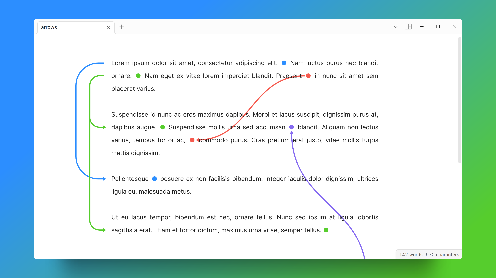
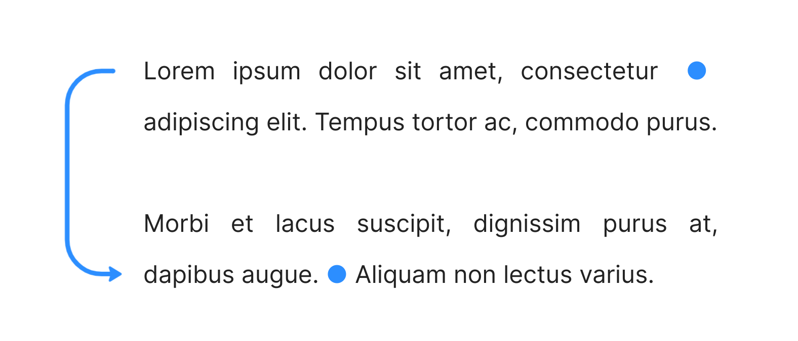
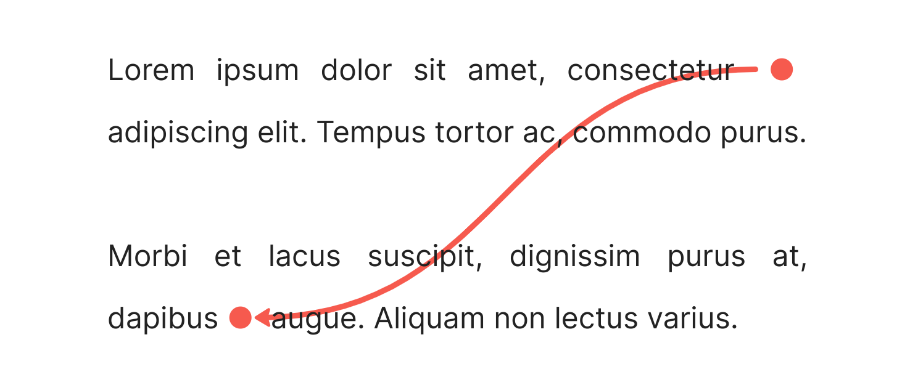
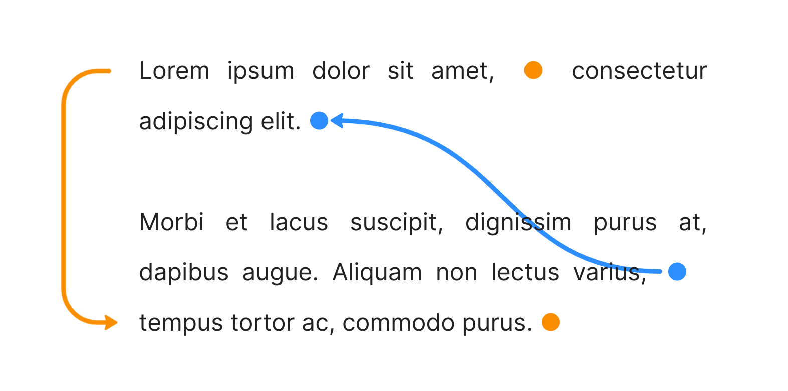
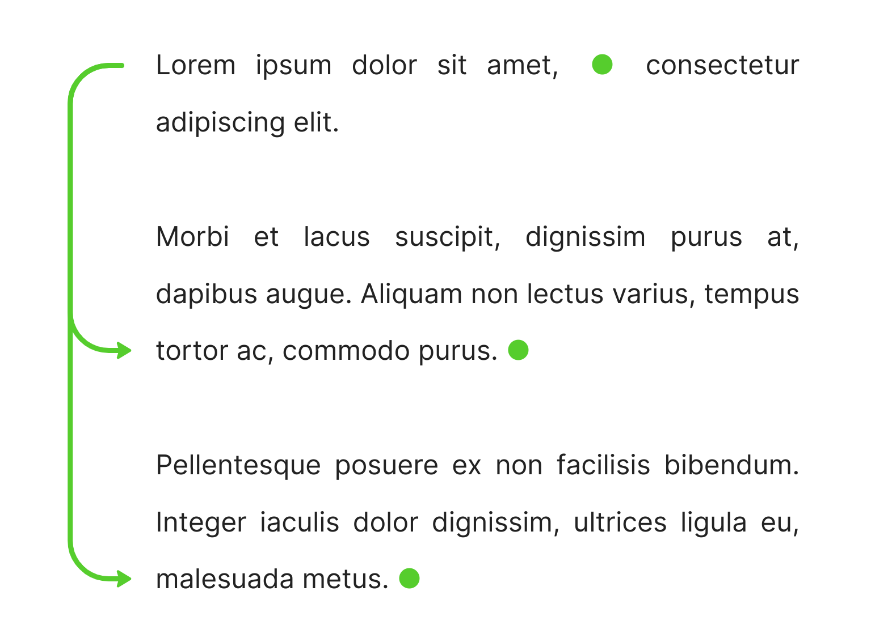
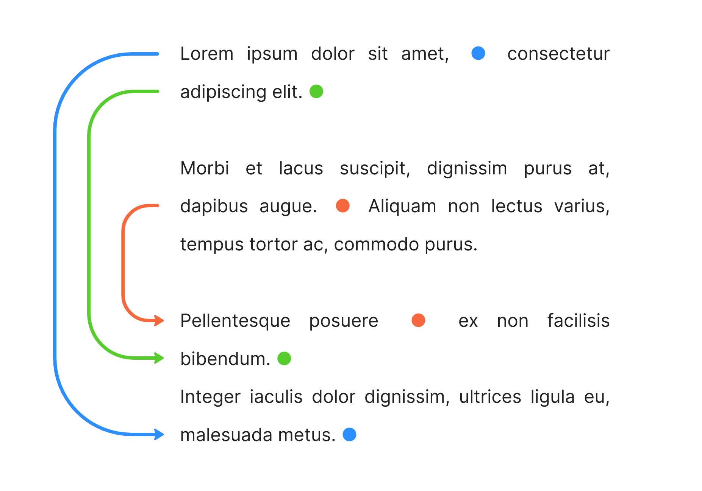
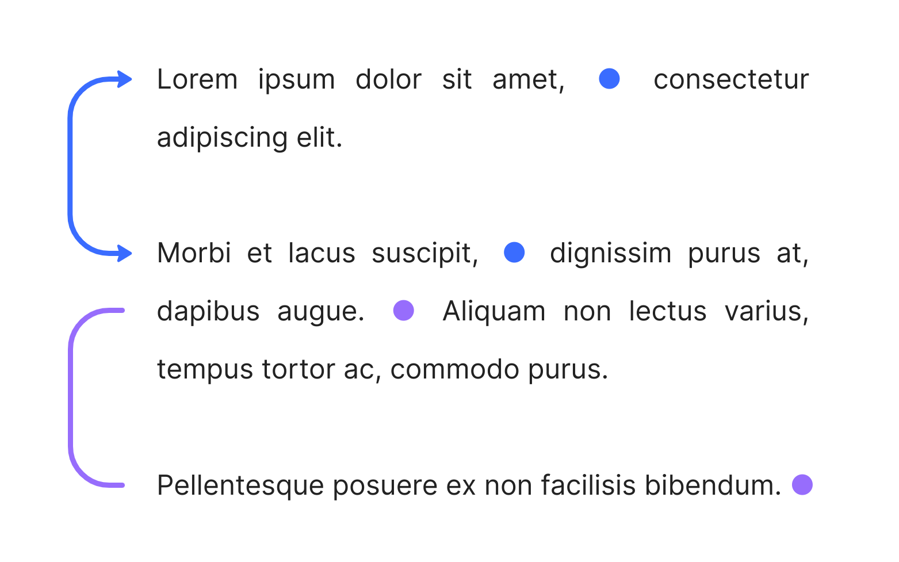

# Arrows
A plugin for [Obsidian](https://obsidian.md/) that lets you draw arrows in your notes, similar to how you might draw arrows across different parts of your notes on paper.

**Works in Live Preview mode only.**



## Usage
### Drawing arrows
Type `{arrow-identifier|color}` to mark the start of an arrow, e.g. `{my-arrow|#1e90ff}`.

Then, type `{arrow-identifier}` elsewhere to mark the end of the arrow; in this case, `{my-arrow}`.

An arrow will be drawn from the start identifier to the end identifier along the margin.

```
Lorem ipsum dolor sit amet, consectetur {my-arrow|#1e90ff} adipiscing elit. Tempus tortor ac, commodo purus.

Morbi et lacus suscipit, dignissim purus at, dapibus augue. {my-arrow} Aliquam non lectus varius.
```


---

### Diagonal arrows
To create a diagonal arrow, append "`|diagonal`" to the start identifier of the arrow, e.g. `{my-arrow|#ff5555|diagonal}`.

```
Lorem ipsum dolor sit amet, consectetur {my-arrow2|#ff5555|diagonal} adipiscing elit. Tempus tortor ac, commodo purus.

Morbi et lacus suscipit, dignissim purus at, dapibus {my-arrow2} augue. Aliquam non lectus varius.
```



---

### Drawing more arrows
You can add more arrows by using different arrow identifiers, e.g. `{this-is-another-arrow|orange}`:

```
Lorem ipsum dolor sit amet, {this-is-another-arrow|orange} consectetur adipiscing elit. {my-arrow3}

Morbi et lacus suscipit, dignissim purus at, dapibus augue. Aliquam non lectus varius, {my-arrow3|#1e90ff|diagonal} tempus tortor ac, commodo purus. {this-is-another-arrow}
```



---

### Multi-arrows
You can have multiple end identifiers corresponding to a single start identifier. An arrow will be drawn for each:

```
Lorem ipsum dolor sit amet, {multi-arrow|limegreen} consectetur adipiscing elit.

Morbi et lacus suscipit, dignissim purus at, dapibus augue. Aliquam non lectus varius, tempus tortor ac, commodo purus. {multi-arrow}

Pellentesque posuere ex non facilisis bibendum. Integer iaculis dolor dignissim, ultrices ligula eu, malesuada metus. {multi-arrow}
```



---

### Adjusting margin arrows
Adjust the x-position of margin arrows by appending "`|x-pos`" to the start identifier, where `x-pos` is a number between 0 and 30, e.g. `{my-arrow|blue|10}`.

```
Lorem ipsum dolor sit amet, {first|dodgerblue|20} consectetur adipiscing elit. {second|limegreen|10}

Morbi et lacus suscipit, dignissim purus at, dapibus augue. {third|tomato} Aliquam non lectus varius, tempus tortor ac, commodo purus.

Pellentesque posuere {third} ex non facilisis bibendum. {second}
Integer iaculis dolor dignissim, ultrices ligula eu, malesuada metus. {first}
```



---

### Arrowheads
Add an arrowhead to the start of an arrow by appending "`|arrow`" to the start identifier.

Remove the arrowhead at the *end* of an arrow by appending "`|no-arrow`" to the end identifier.

```
Lorem ipsum dolor sit amet, {double-arrow|#3d6eff|arrow} consectetur adipiscing elit.

Morbi et lacus suscipit, {double-arrow} dignissim purus at, dapibus augue. {line|#9d6efa} Aliquam non lectus varius, tempus tortor ac, commodo purus.

Pellentesque posuere ex non facilisis bibendum. {line|no-arrow}
```



---

### Navigating between arrows
When the cursor is moved outside of the `{arrow-identifier}` syntax, the syntax will be rendered as a small circle ● for a tidier look.

You can click on any arrow identifier ● to automatically scroll to the next matching identifier. This lets you quickly navigate between arrow start/end positions in a long document.

## Full arrow syntax
Write
- `{arrow-identifier|color|opacity|type|x-position|arrowhead}` to denote the start of an arrow, where:
    - `arrow-identifier` is a string that acts as the arrow's identifier
    - `color` is any valid color in CSS notation, e.g. `red`, `#ff0000`
    - `opacity` (optional) is a float between 0 and 1, e.g. `0.6`. Defaults to 1.
    - `type` (optional) is either "`diagonal`" or "`margin`". Defaults to "`margin`".
    - `x-position` (optional) is an integer between 0 and 30. Sets the x-position of margin arrows. Defaults to 0.
    - `arrowhead` (optional) is either "`no-arrow`" or "`arrow`". Use "`arrow`" to add an arrowhead to the start of the arrow. Defaults to "`no-arrow`".
- `{arrow-identifier}` to denote the end of an arrow.
    - Write `{arrow-identifier|no-arrow}` instead to remove the arrowhead from the end of the arrow.

Arrows will be drawn from each start identifier to all corresponding end identifiers.

## Limitations
Works in Live Preview mode only.

## Contributing
Any contributions and PRs are welcome!

## Acknowledgements
This project uses the [leader-line](https://anseki.github.io/leader-line/) library to draw arrows.
